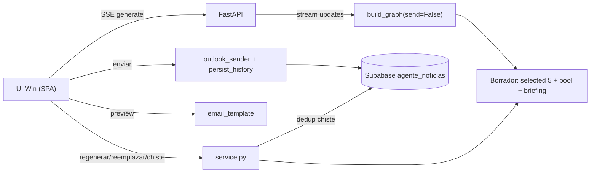
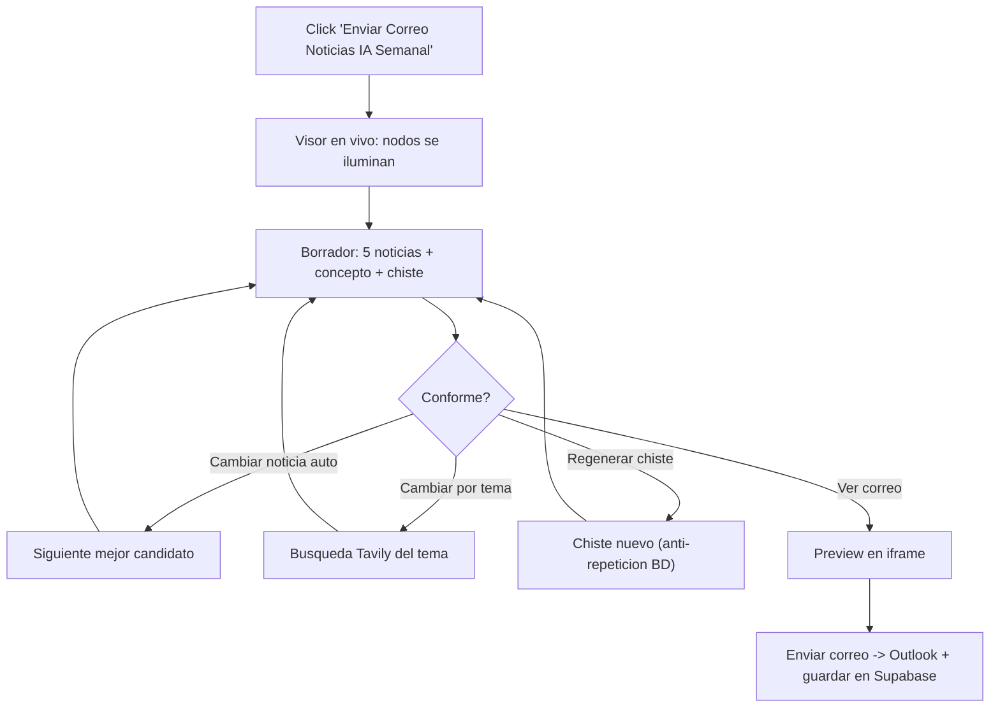

## Interfaz grafica + mejoras del Agente Noticias (Win)

Verificacion previa hecha: Supabase `agente_noticias` OK (1 briefing, 5 sent_articles, RLS activo). El correo y el flujo actuales ya funcionan; esto es aditivo (CLI y Studio siguen igual).

### A. Arreglos visuales del correo
En [email_template.py](Agente Noticias/agente_noticias/email_template.py):
- Logo mas grande: cambiar `height="34"`/`height:34px` (linea ~50) a ~`56px` y ajustar el padding del header.
- Barra de relevancia unica: reemplazar el bloque `` de 10 celdas (lineas ~156-168) por UNA sola barra: una pista gris fija y un relleno naranja proporcional (`width = score*10%`), dentro de una tabla con `border-radius`. Mas limpio y Outlook-safe.

### B. Anti-repeticion del chiste (Supabase)
- Migracion (MCP `apply_migration`): `alter table agente_noticias.briefings add column joke text default '';` (el service_role ya tiene privilegios por default).
- [db.py](Agente Noticias/agente_noticias/db.py): nueva `fetch_recent_jokes(weeks)` (lee `joke` de briefings recientes) y guardar el chiste en `save_briefing(...)`.
- [nodes/summarizer.py](Agente Noticias/agente_noticias/nodes/summarizer.py) y la generacion de chiste: pasar los chistes recientes al prompt ("no repitas estos") y validar con similitud (`text_utils`) reintentando si sale parecido.

### C. Refactor a servicio reutilizable (staged + edicion)
Nuevo [service.py](Agente Noticias/agente_noticias/service.py) con un estado de "borrador" en memoria (un solo usuario local) y funciones que reusan los nodos actuales:
- `generate_draft(progress_cb)`: corre el grafo `build_graph(send=False)` con `graph.stream(..., stream_mode="updates")`, emite progreso por nodo y devuelve `selected` (5), `scored_articles` (pool para reemplazos) y `briefing`.
- `regenerate_article_auto(i)`: cambia la noticia i por el siguiente mejor candidato no usado del pool (sin nueva busqueda; si se agota, busca).
- `replace_article_by_topic(i, topic)`: busca el tema en Tavily, deduplica (historial + seleccion actual), evalua y reemplaza la noticia i.
- `regenerate_joke()`: genera un chiste nuevo evitando los de la BD y el actual.
- `finalize_and_send()`: refresca headline/TLDR/concepto del set final, renderiza, envia por Outlook y persiste (articulos + chiste). Un solo envio.

Schemas/prompts: en [schemas.py](Agente Noticias/agente_noticias/schemas.py) agregar `JokeOut` (campo `chiste`); en [prompts.py](Agente Noticias/agente_noticias/prompts.py) prompt de chiste y de evaluacion de tema manual.

### D. Backend FastAPI
Nuevo [webapp/app.py](Agente Noticias/agente_noticias/webapp/app.py) (sirve la UI estatica + API), estado de sesion en singleton:
- `GET /` -> SPA.
- `GET /api/generate/stream` (SSE) -> eventos `{node, status}` para el visor en vivo y, al final, el borrador.
- `GET /api/preview` -> HTML del correo (para iframe).
- `POST /api/article/{i}/regenerate` y `POST /api/article/{i}/replace` (body `{topic}`).
- `POST /api/joke/regenerate`.
- `POST /api/send` -> envia y persiste.

### E. Frontend Win (SPA)
Nuevos [webapp/static/index.html](Agente Noticias/agente_noticias/webapp/static/index.html), `styles.css`, `app.js` con la paleta Win:
- Boton grande "Enviar Correo Noticias IA Semanal" -> dispara la generacion.
- Visor de flujo en vivo: chips/nodos (researcher -> history_filter -> evaluator -> ranker -> summarizer -> email_writer) que pasan de pendiente -> corriendo (pulsando) -> hecho, via SSE (custom, no mermaid, para animar estados). Enlace a la traza en LangSmith.
- 5 tarjetas de noticias (titulo, resumen, "en simple", categoria, relevancia) con: seleccionar, "Regenerar con otra noticia" (auto) y campo de tema + "Buscar este tema" (manual).
- Seccion de chiste con "Regenerar chiste".
- "Ver correo" -> preview real en iframe; "Enviar correo" -> envio final con confirmacion.

### F. Lanzador + deps
- [scripts/serve.py](Agente Noticias/scripts/serve.py): arranca uvicorn y abre el navegador (p. ej. http://127.0.0.1:8800).
- [pyproject.toml](Agente Noticias/pyproject.toml): agregar `fastapi` y `uvicorn`; `uv sync`.
- README: seccion "Interfaz web".

### Arquitectura

### Flujo de uso

### Verificacion
- `uv run python scripts/serve.py` abre la UI; el boton genera el borrador mostrando el flujo en vivo.
- Cambiar 1-2 noticias (auto y por tema) actualiza las tarjetas y el preview.
- Regenerar chiste no repite uno ya guardado (se valida contra Supabase).
- "Enviar correo" manda UN solo correo y agrega 1 briefing (con `joke`) + 5 sent_articles.
- El correo muestra el logo mas grande y una sola barra de relevancia.